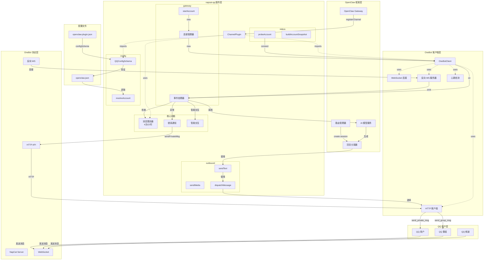
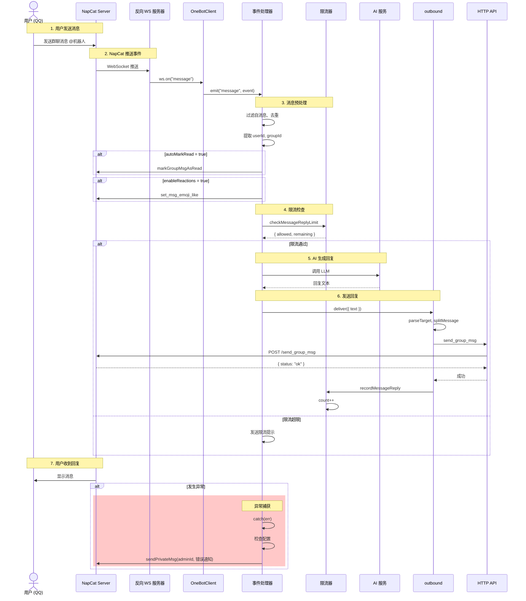
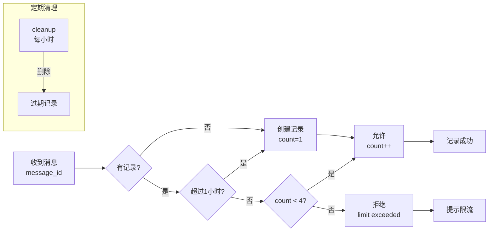
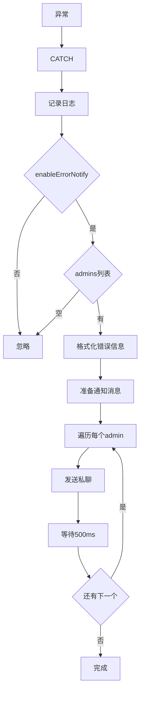
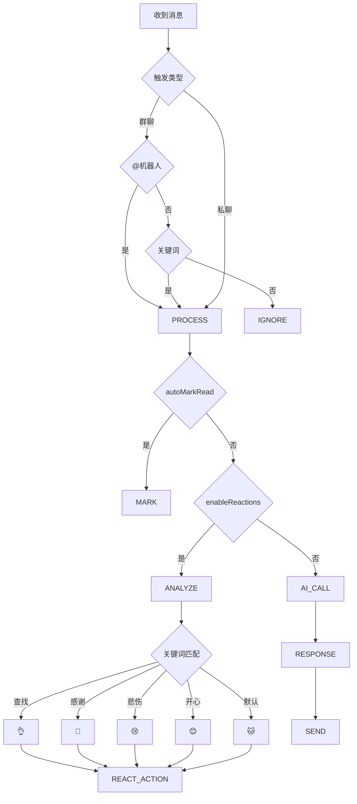

# napcat-qq 插件 - 系统架构图 (GitHub 兼容版)

## 1. 整体架构图

## 2. 消息处理详细时序图

## 3. 消息限流机制

## 4. 错误通知流程

## 5. 智能交互逻辑

## 6. 配置项全景图

```mermaid
graph TD
    CONFIG[openclaw.json] --> CATEGORY1[核心配置]
    CONFIG --> CATEGORY2[功能开关]
    CONFIG --> CATEGORY3[风控优化]
    CONFIG --> CATEGORY4[管理限制]
    CONFIG --> CATEGORY5[AI配置]

    CATEGORY1 --> WS[wsUrl]
    CATEGORY1 --> HTTP[httpUrl]
    CATEGORY1 --> PORT[reverseWsPort]
    CATEGORY1 --> TOKEN[accessToken]

    CATEGORY2 --> MENTION[requireMention]
    CATEGORY2 --> DEDUP[enableDeduplication]
    CATEGORY2 --> ERROR[enableErrorNotify]
    CATEGORY2 --> REACT[enableReactions]
    CATEGORY2 --> READ[autoMarkRead]
    CATEGORY2 --> TTS[enableTTS]
    CATEGORY2 --> GUILD[enableGuilds]

    CATEGORY3 --> RATE[rateLimitMs]
    CATEGORY3 --> LEN[maxMessageLength]
    CATEGORY3 --> MD[formatMarkdown]
    CATEGORY3 --> RISK_MODE[antiRiskMode]

    CATEGORY4 --> ADMIN_LIST[admins数组]
    CATEGORY4 --> GROUPS[allowedGroups]
    CATEGORY4 --> BLOCK[blockedUsers]
    CATEGORY4 --> HISTORY[historyLimit]
    CATEGORY4 --> KEYWORDS[keywordTriggers]

    CATEGORY5 --> PROMPT[systemPrompt]
    CATEGORY5 --> VOICE[aiVoiceId]
```

---

## 使用说明

以上图表使用 **Mermaid** 语法，GitHub 会自动渲染。如果某个图表无法显示，可能是：

1. **语法过于复杂** - 已简化处理
2. **emoji 符号** - 部分图表保留了简单表情，应该兼容
3. **HTML 标签** - 已全部替换为 `\n`

如果仍有问题，可以访问 [Mermaid Live Editor](https://mermaid.live) 粘贴代码查看完整渲染效果。

## 关键文件

| 文件 | 说明 | 行数 |
|------|------|------|
| src/channel.ts | 主插件实现 | ~1000 |
| src/client.ts | OneBot 客户端 | ~400 |
| src/config.ts | Zod Schema | ~30 |
| openclaw.plugin.json | 插件元数据 | ~140 |

---

**基于 `napcat-qq` 分支当前代码**

