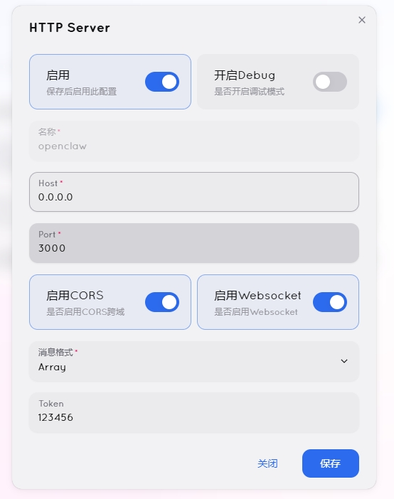
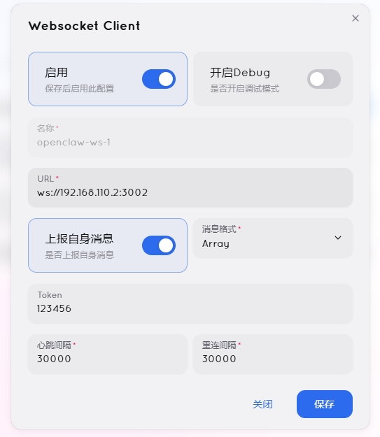

[**中文**](README_CN.md) | English

# OpenClaw QQ Plugin (OneBot v11)

This plugin provides full-featured QQ channel support for [OpenClaw](https://github.com/openclaw/openclaw) via the OneBot v11 protocol (WebSocket). It supports not only basic chat, but also group management, channels, multimodal interactions, and production-grade risk control.

## ✨ Core Features

### 🧠 Deep Intelligence & Context
*   **History Context**: Automatically fetch the last N messages in group chats (default: 5), allowing AI to understand previous conversation.
*   **System Prompt**: Support custom prompts for the bot to play specific roles (e.g., "catgirl", "strict admin").
*   **Forwarded Message Understanding**: AI can parse and read merged forwarded chat records.
*   **Keyword Triggers**: Besides @mentioning the bot, configure specific keywords (e.g., "assistant") to trigger conversation without needing to @mention.

### 🛡️ Powerful Management & Risk Control
*   **Connection Self-Healing**: Built-in heartbeat detection and exponential backoff reconnection, automatically identifying and fixing "zombie connections" for 24/7 online operation.
*   **Group Management Commands**: Admins can use commands to manage group members (mute/kick) directly in QQ.
*   **Whitelist/Blacklist**:
    *   **Group Whitelist**: Only respond in specified groups, avoiding being added to spam groups.
    *   **User Blacklist**: Block malicious users.
*   **Auto Request Handling**: Configurable auto-accept friend requests and group invites for unattended operation.
*   **Production-Grade Risk Control**:
    *   **Default @Mention Trigger**: `requireMention` is enabled by default, only responding when @mentioned, protecting tokens and not disturbing others.
    *   **Rate Limiting**: Automatically insert random delays between multiple messages to avoid QQ risk control bans.
    *   **URL Avoidance**: Automatically process links (e.g., add spaces) to reduce message filtering.
    *   **System Account Blocking**: Automatically filter interference from system accounts like QQ Manager.

### 🎭 Rich Interactive Experience
*   **Poke**: When users "poke" the bot, AI perceives it and responds interestingly. Supports both group and private chat pokes.
*   **Reactions**: When triggered, automatically add emoji reactions (like thumbs up) to messages.
*   **Mark Read**: Automatically mark messages as read to avoid unread pile-up.
*   **AI Voice**: Using NapCat's native AI Voice API, supports rich voice characters, more natural than traditional TTS.
*   **Human-like Replies**:
    *   **Auto @Mention**: In group replies, automatically @mention the original sender (only in the first message segment), following human social etiquette.
    *   **Nickname Parsing**: Convert `[CQ:at]` codes in messages to real nicknames (e.g., `@ZhangSan`), making AI replies more natural.
*   **Multimodal Support**:
    *   **Images**: Support sending/receiving images. Optimized for `base64://` format, works even when bot and OneBot server are not on the same LAN.
    *   **Voice**: Receive voice messages (requires server STT support) and optional TTS voice replies.
    *   **Files**: Support group file and private chat file sending/receiving.
*   **QQ Channel (Guild)**: Native support for QQ channel message sending/receiving.

---

## 📋 Prerequisites

1.  **OpenClaw**: OpenClaw main program installed and running.
2.  **OneBot v11 Server**: You need a running OneBot v11 implementation.
    *   Recommended: **[NapCat (Docker)](https://github.com/NapCatQQ/NapCat-Docker)** (4.16.0+) or **Lagrange**.
    *   **Important**: Please set `message_post_format` to `array` in OneBot configuration, otherwise multimedia messages cannot be parsed.

### NapCat Configuration Reference

#### 1. HTTP Configuration


#### 2. WebSocket Reverse Configuration


> **Note**: In WS reverse configuration, the URL must be the IP of the server running OpenClaw (e.g., `ws://192.168.110.2:3002`), not `127.0.0.1`.

---

## 🚀 Installation Guide

### Quick Deploy (One-Line Command)

```bash
# One-line command to install QQ plugin
curl -fsSL https://gh-proxy.com/https://raw.githubusercontent.com/Daiyimo/openclaw-napcat/main/install.sh | sudo bash

# One-line command to modify JSON files
curl -fsSL https://gh-proxy.com/https://raw.githubusercontent.com/Daiyimo/openclaw-napcat/main/update_json.sh | sudo bash
```

### Method 2: Using OpenClaw CLI (Recommended)
If your OpenClaw version supports plugin market or CLI installation:
```bash
# Enter plugin directory
cd openclaw/extensions
# Clone repository
git clone https://gh-proxy.com/https://github.com/Daiyimo/openclaw-napcat.git qq
# Enter qq plugin directory
cd qq
npm install -g pnpm
# Install dependencies
pnpm install
```

---

## ⚙️ Configuration

### 1. Quick Config (update_json.sh)
The plugin includes an interactive configuration script. Run in the plugin directory:

```bash
bash update_json.sh
```

The script will:
1. Interactively collect configuration (reverse WS port, HTTP API address, admin QQ number)
2. Backup and update `~/.openclaw/openclaw.json`
3. Check QQ plugin status, prompt to start if not detected
4. Print device pairing guide (required for OpenClaw 2026.2.25+), wait for user confirmation
5. Execute `sudo openclaw gateway` to start gateway (foreground, logs direct)

After starting the gateway, complete device pairing in another terminal following the guide.

### 2. Standard Config (OpenClaw Setup)
If integrated into OpenClaw CLI:
```bash
openclaw setup qq
```

### 3. Manual Config (`openclaw.json`)
You can also edit the config file directly. Full config:

```json
{
  "channels": {
    "qq": {
      "reverseWsPort": 3002,
      "httpUrl": "http://127.0.0.1:3000",
      "accessToken": "123456",
      "admins": [12345678],
      "allowedGroups": [10001, 10002],
      "blockedUsers": [999999],
      "systemPrompt": "You are a helpful assistant.",
      "historyLimit": 5,
      "keywordTriggers": ["assistant", "help"],
      "autoApproveRequests": true,
      "enableGuilds": true,
      "enableTTS": false,
      "rateLimitMs": 1000,
      "formatMarkdown": true,
      "antiRiskMode": false,
      "maxMessageLength": 4000,
      "reactionEmoji": "",
      "autoMarkRead": false,
      "aiVoiceId": ""
    }
  },
  "gateway": {
    "controlUi": {
      "allowInsecureAuth": true,
      "dangerouslyAllowHostHeaderOriginFallback": true
    },
    "trustedProxies": ["127.0.0.1", "192.168.110.0/24"]
  },
  "plugins": {
    "entries": {
      "qq": { "enabled": true }
    }
  }
}
```

> **Note (OpenClaw 2026.2.25+)**: `gateway` section is required. 2026.2.26 added Host header validation; when binding `0.0.0.0`, configure `dangerouslyAllowHostHeaderOriginFallback: true`. 2026.2.25 blocked silent auto-pairing; first-time WebUI access requires device pairing (see below).

| Config | Type | Default | Description |
| :--- | :--- | :--- | :--- |
| `wsUrl` | string | - | OneBot v11 forward WebSocket address. Choose one with `reverseWsPort`, or configure both as backup |
| `httpUrl` | string | - | OneBot v11 HTTP API address (e.g., `http://localhost:3000`) for主动发送消息和定时任务 |
| `reverseWsPort` | number | - | Reverse WebSocket listening port (e.g., `3002`), NapCat actively connects to this port |
| `accessToken` | string | - | Connection authentication token |
| `admins` | number[] | `[]` | **Admin QQ numbers**. Can execute `/status`, `/kick` and other commands. |
| `requireMention` | boolean | `true` | **Require @mention to trigger**. Set `true` to only respond when @mentioned or replying to bot. |
| `allowedGroups` | number[] | `[]` | **Group whitelist**. If set, bot only responds in these groups; if empty, responds in all groups. |
| `blockedUsers` | number[] | `[]` | **User blacklist**. Bot will ignore messages from these users. |
| `systemPrompt` | string | - | **Personality setting**. System prompt injected into AI context. |
| `historyLimit` | number | `5` | **History message count**. Bring last N messages to AI in group chat, set 0 to disable. |
| `keywordTriggers` | string[] | `[]` | **Keyword triggers**. In group chats, messages containing these keywords will trigger the bot without needing to @mention (private chats also work). |
| `autoApproveRequests` | boolean | `false` | Auto-accept friend requests and group invites. |
| `enableGuilds` | boolean | `true` | Enable QQ Channel (Guild) support. |
| `enableTTS` | boolean | `false` | (Experimental) Convert AI replies to voice (requires server TTS support). |
| `rateLimitMs` | number | `1000` | **Rate limiting**. Delay between messages (ms), recommend 1000 to prevent risk control. |
| `formatMarkdown` | boolean | `false` | Convert Markdown tables/lists to readable plain text. |
| `antiRiskMode` | boolean | `false` | Enable risk avoidance (e.g., add spaces to URLs). |
| `maxMessageLength` | number | `4000` | Max message length, auto-split if exceeded. |
| `reactionEmoji` | string | - | Auto-react emoji ID when triggered (e.g., `"128077"` for thumbs up), empty to disable. |
| `autoMarkRead` | boolean | `false` | Auto-mark messages as read to prevent unread pile-up. |
| `aiVoiceId` | string | - | NapCat AI Voice character ID, uses AI Voice API instead of CQ:tts when `enableTTS` is on. |

---

## Device Pairing (OpenClaw 2026.2.25+)

From OpenClaw 2026.2.25, first-time browser WebUI access requires device pairing, otherwise WebSocket connections are rejected (error 4008).

### Pairing Steps

**1. After starting service, open WebUI in browser** (shows waiting for pairing prompt):
```
http://<serverIP>:18789
```

**2. Open another terminal, check pending device requests:**
```bash
sudo openclaw devices list
```
Example output (find UUID from `Request` column in `Pending` table):
```
Pending (1)
┌────────────────────────────┬────────┬─────...
│ Request                    │ Device │ ...
├────────────────────────────┼────────┼─────...
│ 755e8961-2b4d-4440-81a5-   │ ...    │ ...
│ a3691f8374ca               │        │ ...
└────────────────────────────┴────────┴─────...
```

**3. Approve the request (concatenate multi-line Request column to get full UUID):**
```bash
sudo openclaw devices approve 755e8961-2b4d-4440-81a5-a3691f8374ca
```

**4. Refresh browser**, WebUI now accessible.

> Pairing only needs to be done once; same device with token won't need re-approval.

---

## 🎮 Usage Guide

### 🗣️ Basic Chat
*   **Private Chat**: Send message directly to bot.
*   **Group Chat**:
    *   **@bot** + message.
    *   Reply to bot's message.
    *   Message containing a configured **keyword** (e.g., "assistant").
    *   **Poke** bot's avatar.

### 👮‍♂️ Admin Commands
Only users in `admins` list can use. **@mention bot in group chats** to trigger, in private chats just send directly:

*   `/status`
    *   View bot status (memory usage, connection status, Self ID).
*   `/help`
    *   Show help menu.
*   `/mute @user [minutes]` (group only)
    *   Mute specified user. Default 30 minutes if not specified.
    *   Example: `/mute @ZhangSan 10`
*   `/kick @user` (group only)
    *   Remove specified user from group.

### 💻 CLI Commands
If operating OpenClaw from server terminal:

1.  **Check Status**
    ```bash
    openclaw status
    ```
    Shows QQ connection status, latency, and current bot nickname.

2.  **List Groups/Channels**
    ```bash
    openclaw list-groups --channel qq
    ```
    List all joined groups and channel IDs.

3.  **Send Message Actively**
    ```bash
    # Send private message
    openclaw send qq 12345678 "Hello, this is a test message"
    
    # Send to group (use group: prefix)
    openclaw send qq group:88888888 "Hello everyone"
    
    # Send channel message
    openclaw send qq guild:GUILD_ID:CHANNEL_ID "Channel message"
    ```

### 📅 Cron `to` Field Format

In OpenClaw cron config, `to` field specifies message target. **Must use correct prefix to distinguish target type**, otherwise defaults to private message, causing `sendPrivateMsg` error "Please specify correct group_id or user_id".

| Target Type | `to` Format | Example |
| :--- | :--- | :--- |
| **Private** | `QQ号` or `private:QQ号` | `"12345678"` or `"private:12345678"` |
| **Group** | `group:群号` | `"group:88888888"` |
| **Channel** | `guild:频道ID:子频道ID` | `"guild:123456:789012"` |

**Config Example** (cron section in `openclaw.json`):

```json
{
  "cron": [
    {
      "schedule": "0 9 * * *",
      "delivery": {
        "channel": "qq",
        "to": "group:88888888",
        "text": "Good morning, keep fighting!"
      }
    },
    {
      "schedule": "0 18 * * *",
      "delivery": {
        "channel": "qq",
        "to": "private:12345678",
        "text": "Work reminder: Remember to drink water~"
      }
    },
    {
      "schedule": "0 12 * * *",
      "delivery": {
        "channel": "qq",
        "to": "guild:GUILD_ID:CHANNEL_ID",
        "text": "Noon broadcast"
      }
    }
  ]
}
```

> **Note**: Pure numbers in `to` (e.g., `"12345678"`) are treated as private QQ numbers. To send to groups, **must add `group:` prefix**.

---

## ❓ FAQ

**Q: Dependency error `openclaw @workspace:*` not found?**
A: This is caused by workspace protocol in main repo. Fixed in latest version; after `git pull`, use `pnpm install` or `npm install` directly without special environment.

**Q: Bot doesn't respond to images?**
A: 
1. Confirm your OneBot implementation (e.g., NapCat) has image reporting enabled.
2. Recommend enabling "Image to Base64" in OneBot config; even if OpenClaw is on a public cloud server, it can receive images from local intranet bots.
3. Plugin now auto-detects and extracts images; `message_post_format: array` no longer required.

**Q: Bot and OneBot not in same network (non-LAN)?**
A: **Absolutely works**. As long as `wsUrl` is accessible via NAT or public IP, and images are transmitted via Base64, cross-region deployment is possible.

**Q: Why no response in group chat?**
A: 
1. Check if `requireMention` is enabled (default), need to @bot.
2. Check if group is in `allowedGroups` whitelist (if set).
3. Check OneBot logs to confirm messages are being reported.

**Q: How to make Bot speak (TTS)?**
A: Set `enableTTS` to `true`. Note: depends on OneBot server TTS support. NapCat/Lagrange have limited support; may need additional plugins.
